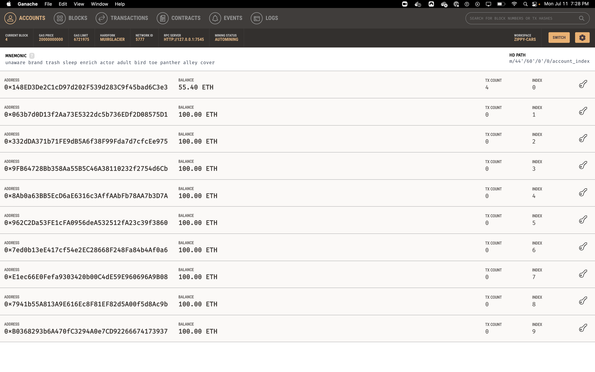
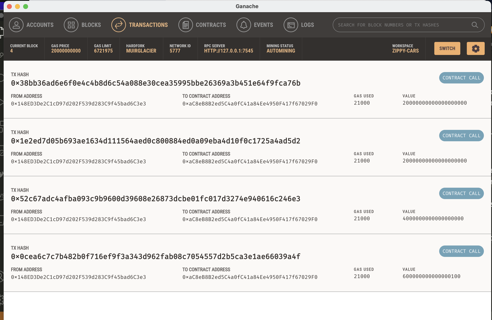
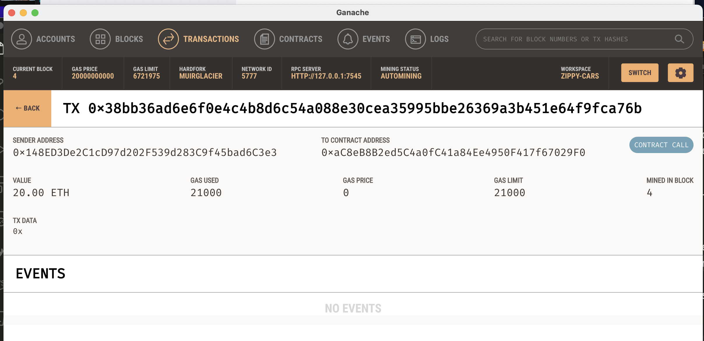

## Unit 19 Homework: Cryptocurrency Wallet


**User Story** - *You work at a startup that is building a new and disruptive platform called Fintech Finder. Fintech Finder is an application that its customers can use to find fintech professionals from among a list of candidates, hire them, and pay them. As Fintech Finder’s lead developer, you have been tasked with integrating the Ethereum blockchain network into the application in order to enable your customers to instantly pay the fintech professionals whom they hire with cryptocurrency.*

**Objective** - *Complete the code that enables your customers to send cryptocurrency payments to fintech professionals. Assume the perspective of a Fintech Finder customer who is using the application to find a fintech professional and pay them for their work.*

### Installations

- [Install Ganache](https://trufflesuite.com/ganache/)
- CLI installations (conda and C++ compiler required):
```
conda activate base
conda create --name localstreamlitenv python=3.7 -y
conda activate localstreamlitenv
conda install -c conda-forge python-dotenv -y
conda install -c conda-forge m2w64-gcc -y
conda install -c conda-forge jupyterlab -y
pip install web3==5.17
pip install eth-tester==0.5.0b3
pip install mnemonic
pip install bip44
pip install streamlit
pip install --upgrade typing-extensions
```
    
### Fintech Finder Application

To launch app locally: 

- Open Ganache, start session. (Ensure matching passphrase is in local .env file)

- Run commands:

    ```
    conda activate localstreamlitenv
    streamlit run fintech_finder.py
    ``` 

**Frontend/Backend** - *Two Python files:*

`fintech_finder.py` (front end) - contains the code associated with the web interface of the application. The code included in this file is compatible with the Streamlit library. 

`crypto_wallet.py` (back end) - Contains Ethereum transaction functions used in fintech_finder. 

Integrating these two files allows automation of the tasks associated with generating a digital wallet, accessing Ethereum account balances, and signing and sending transactions via a personal Ethereum blockchain called Ganache.

**Goals:**

* Generate a new Ethereum account instance by using the mnemonic seed phrase provided by Ganache.

* Fetch and display the account balance associated with the Ethereum account address.

* Calculate the total value of an Ethereum transaction, including the gas estimate, that pays a Fintech Finder candidate for their work. (*Note: Ethereum values used are not current*)

* Digitally sign a transaction that pays a Fintech Finder candidate, and send this transaction to the Ganache blockchain.

* Review the transaction hash code associated with the validated blockchain transaction.

---

### Image Confirmation of App Functionality








---

© 2021 Trilogy Education Services, a 2U, Inc. brand. All Rights Reserved.
